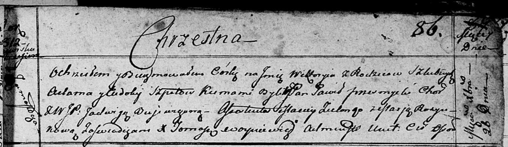

**Шпет (Скакун) Евдокия (Szpetowa Ewdokija z Skakunow)**

13 октября 1807 г -- венчание с Адамом Шпетом с деревни Замосточье (НИАБ
136-13-920, лист 12об, №4/1807-б (ориг)).

23 января 1810 г -- крещение сына Винцентыя (НИАБ 136-13-894, лист 76об,
№4/1810-р (ориг)).

26 декабря 1812 г -- крещение дочери Викторыи (НИАБ 136-13-894, лист 86,
№61/1812-р (ориг)).

**НИАБ 136-13-920:** Лист 12об. **Метрическая запись №4/1807-б (ориг).**

{width="6.496527777777778in"
height="1.8754035433070866in"}

Дедиловичская Покровская церковь. 13 октября 1807 года. Метрическая
запись о венчании.

Szpet Adam -- жених, с деревни Замосточье.

Skakunowna Ewdokia -- невеста, девка, с деревни Осовo.

Zielonka Macwiey -- свидетель, с деревни Замосточье.

Skakun Andrzey -- свидетель, с деревни Осовo.

Jazgunowicz Antoni -- ксёндз.

**НИАБ 136-13-894:** Лист 76об. **Метрическая запись №4/1810-р (ориг).**

{width="6.496527777777778in"
height="1.05537510936133in"}

Дедиловичская Покровская церковь. 23 января 1810 года. Метрическая
запись о крещении.

Szpet Wincenty -- сын родителей из деревни Замосточье.

Szpet Adam -- отец.

Szpetowa Ewdokija -- мать.

Zielonka Maciey -- кум.

Szpetowna Marianna -- кума.

Mieszkun Marek -- ксёндз, комендант Дедиловичского костела.

Лист 86. **Метрическая запись №61/1812-р (ориг).**

{width="6.496527777777778in"
height="1.8888145231846019in"}

Осовская Покровская церковь. 26 декабря 1812 года. Метрическая запись о
крещении.

Szpetowna Wiktoryia -- дочь родителей с деревни Замосточье.

Szpet Adam -- отец.

Szpetowa Eudokija -- мать Замосточье.

Przemysło Paweł, JP -- кум, шляхтич.

Bujewiczowna Jadwiga, WJP -- кума, шляхтянка.

Zielonko Maciey -- ассистент.

Rozynkowa Marja -- ассистентка.

Woyniewicz Tomasz -- ксёндз.
