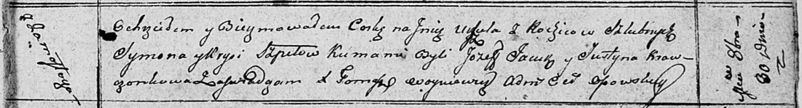

**Шпет Сымон (Szpet Symon)**

30 октября 1810 г -- крещение дочери Уршули (НИАБ 136-13-894, лист 76об,
№4/1810-р (ориг)).

**НИАБ 136-13-894:** Лист 79. **Метрическая запись №51/1810-р (ориг).**

Осовская Покровская церковь. 30 октября 1810 года. Метрическая запись о
крещении.

Szpetowna Urszula -- дочь родителей с деревни Замосточье.

Szpet Symon -- отец.

Szpetowa Krysia -- мать.

Jacuk Jozef -- кум.

Krawczonkowa Justyna -- кума.

Woyniewicz Tomasz -- ксёндз.
