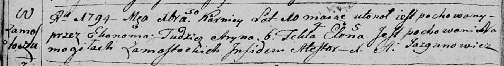

**Карней (Karniey)**

30 декабря 1794 г -- отпевание, умер в возрасте 10 лет (родился около
1784 г) (НИАБ 136-13-919, лист 3об, №57/1794-у (ориг)).

**НИАБ 136-13-894:** Лист 3об. **Метрическая запись №57/1794-у (ориг).**

Дедиловичская Покровская церковь. 30 декабря 1794 года. Метрическая
запись об отпевании.

Karniey -- умерший, 10 лет, с деревни Замосточье, утонул, похоронен на
кладбище деревни Замосточье.

Aryna -- умершая, 6 лет, с деревни Замосточье, похоронена на кладбище
деревни Замосточье.

Tekla -- умершая, 4 года, с деревни Замосточье, похоронена на кладбище
деревни Замосточье.

Elena -- умершая, 5 лет, с деревни Замосточье, похоронена на кладбище
деревни Замосточье.

Jazgunowicz Antoni -- ксёндз.
