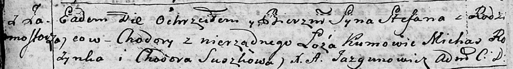

**Степан (Stefan)**

15 июля 1795 г -- крещение (НИАБ 136-13-894, лист 24об, №20/1795-р
(ориг)), (РГИА 823-2-18, лист 252об, №17/1795-р (коп)).

**НИАБ 136-13-894:** Лист 24-об. **Метрическая запись №20/1795-р
(ориг).**

Дедиловичская Покровская церковь. 15 июля 1795 года. Метрическая запись
о крещении.

Stefan -- незаконнорожденный сын с деревни Замосточье.

Chodora -- мать.

Rozynko Michaś - кум.

Suszkowa Chodora - кума.

Jazgunowicz Antoni -- ксёндз.

**РГИА 823-2-18:** Лист 252об. **Метрическая запись №17/1795-р (коп).**

Дедиловичская Покровская церковь. 15 июля 1795 года. Метрическая запись
о крещении.

Stefan -- незаконнорожденный сын матери с деревни Замосточье.

Chodora -- мать.

Rozynka Michaś -- кум.

Suszkowa Chodora -- кума.

Jazgunowicz Antoni -- ксёндз.
