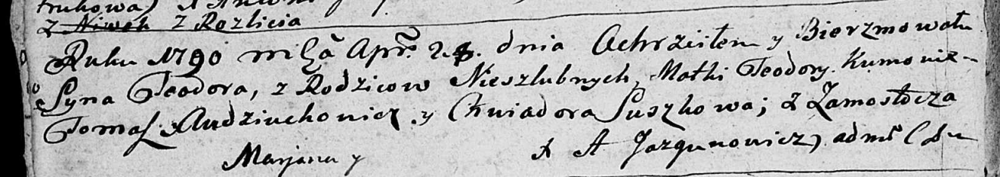

**Тодор (Teodor)**

28 апреля 1790 г -- крещение (НИАБ 136-13-894, лист 9об, №26/1790-р
(ориг)).

**НИАБ 136-13-894:** Лист 9об. **Метрическая запись №26/1790-р (ориг).**

{width="6.496527777777778in"
height="1.1532699037620298in"}

Дедиловичская Покровская церковь. 28 апреля 1790 года. Метрическая
запись о крещении.

Teodor -- незаконнорожденный сын матери с деревни Замосточье.

Teodora -- мать.

Audziuchowicz Tomasz - кум.

Suszkowa Chwiadora - кума.

Jazgunowicz Antoni -- ксёндз.
