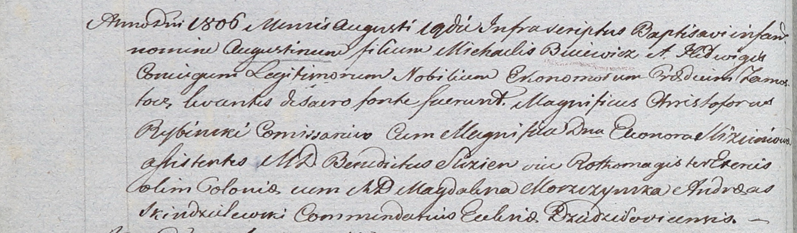

**Буевич Августин Михалов (Buiewicz Augustin)**

19 августа 1806 г -- крещение (НИАБ 937-4-32, лист 13об, №14/1806-р).

**НИАБ 937-4-32:** Лист 13об. **Метрическая запись №14/1806-р.**

{width="6.496527777777778in"
height="1.9069444444444446in"}

Дедиловичский костел Наисвятейшего Сердца Иисуса. 19 августа 1806 года.
Метрическая запись о крещении.

Buiewicz Augustin -- сын шляхтичей со двора Замосточье.

Buiewicz Michael -- отец, эконом Замосточский.

Buiewiczowa Hedwiga -- мать.

Rybinski Christophor -- крестный отец, шляхтич, комиссар.

Slizieniowa Eleonora -- крестная мать, шляхтянка.

Slizien Benedict - ассистент, шляхтич.

Moszczynska Magdalena - ассистентка, шляхтянка.

Skindzelewski Andreas -- ксёндз, комендант Дедиловичский.
