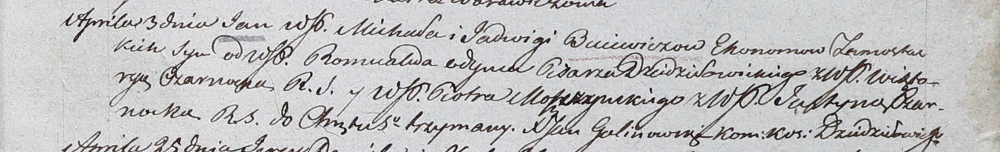
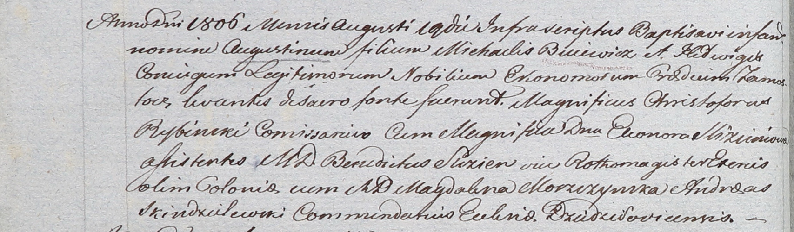

**Буевич Ядвига (Buiewiczowa Jadwiga)**

3 апреля 1804 г -- крещение сына Яна (НИАБ 937-4-32, лист 10,
№6/1804-р).

19 августа 1806 г -- крещение сына Августина (НИАБ 937-4-32, лист 13об,
№14/1806-р).

**НИАБ 937-4-32:** Лист 10. **Метрическая запись №6/1804-р.**

Дедиловичский костел Наисвятейшего Сердца Иисуса. 3 апреля 1804 года.
Метрическая запись о крещении.

Buiewicz Jan -- сын шляхтичей со двора Замосточье.

Buiewicz Michał -- отец, эконом Замосточский.

Buiewiczowa Jadwiga -- мать.

Odyniec Romuald -- крестный отец, шляхтич, писарь Дедиловичский.

Czarnocka Wiktorya -- крестная мать, шляхтянка.

Moszczynski Piotr - ассистент, шляхтич.

Czarnocka Justyna - ассистентка, шляхтянка.

Galinowski Joann -- ксёндз, комендант Дедиловичского костела.

**НИАБ 937-4-32:** Лист 13об. **Метрическая запись №14/1806-р.**

Дедиловичский костел Наисвятейшего Сердца Иисуса. 19 августа 1806 года.
Метрическая запись о крещении.

Buiewicz Augustin -- сын шляхтичей со двора Замосточье.

Buiewicz Michael -- отец, эконом Замосточский.

Buiewiczowa Hedwiga -- мать.

Rybinski Christophor -- крестный отец, шляхтич, комиссар.

Slizieniowa Eleonora -- крестная мать, шляхтянка.

Slizien Benedict - ассистент, шляхтич.

Moszczynska Magdalena - ассистентка, шляхтянка.

Skindzelewski Andreas -- ксёндз, комендант Дедиловичский.
