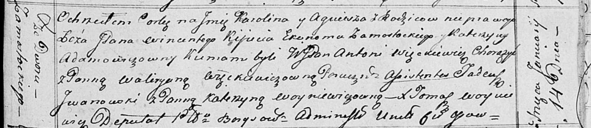

**Адамович Катерына (Adamowiczowna Katerzyna)**

14 января 1817 г -- крещение незаконнорожденной дочери Агнешки (НИАБ
136-13-894, лист 95, №2/1817-р (ориг)).

**НИАБ 136-13-894:** Лист 95. **Метрическая запись №2/1817-р (ориг).**

Осовская Покровская церковь. 14 января 1817 года. Метрическая запись о
крещении.

Karołina Agnieszka -- незаконнорожденная дочь со двора Замосточье.

Kijuc Wincenty, JP -- отец, шляхтич, эконом Замосточья, со двора
Замосточье.

Adamowiczowna Katerzyna -- мать со двора Замосточье.

Węckiewicz Antoni, WJP -- кум, шляхтич, хорунжий.

Grzeckiewiczowna Waliryana -- кума, поручица.

Jwanowski Tadeusz -- ассистент.

Woyniewiczowna Katerzyna, JP -- ассистентка, шляхтянка.

Woyniewicz Tomasz -- ксёндз.
