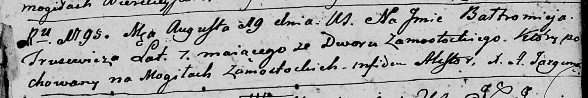

**Трусевич Балтромей (Trusewicz Bałtromiey)**

19 августа 1795 г -- отпевание, умер в возрасте 7 лет (родился около
1788 г) (НИАБ 136-13-919, лист 5, №27/1795-у (ориг)).

**НИАБ 136-13-919:** Лист 5. **Метрическая запись №27/1795-у (ориг).**

Дедиловичская Покровская церковь. 19 августа 1795 года. Метрическая
запись об отпевании.

Trusewicz Bałtromiey -- умерший, 7 лет, со двора Замосточье, похоронен
на кладбище деревни Замосточье.

Jazgunowicz Antoni -- ксёндз.
