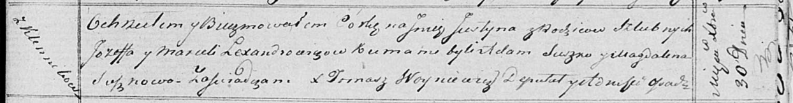

**Александрович Марцеля (Lexandrowiczowa Marcela)**

30 декабря 1818 г -- крещение дочери Юстыны (НИАБ 136-13-894, лист 100,
№48/1818-р (ориг)).

**НИАБ 136-13-894:** Лист 100. **Метрическая запись №48/1818-р (ориг).**

Осовская Покровская церковь. 30 декабря 1818 года. Метрическая запись о
крещении.

Lexandrowiczowna Justyna -- дочь родителей с деревни Клинники.

Lexandrowicz Jozef -- отец.

Lexandrowiczowa Marcela -- мать.

Suszko Adam -- кум.

Suszkowa Magdalena -- кума.

Woyniewicz Tomasz -- ксёндз.
