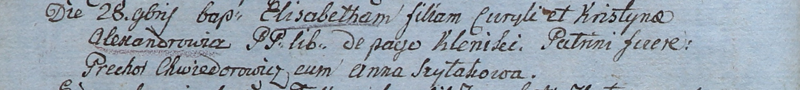

**Александрович Элизабета Курылова (Alexandrowiczowna Elisabetha)**

28 ноября 1805 г -- крещение (НИАБ 937-4-32, лист 12об, №42/1805-р).

**НИАБ 937-4-32:** Лист 12об. **Метрическая запись №42/1805-р.**

Дедиловичский костел Наисвятейшего Сердца Иисуса. 28 ноября 1805 года.
Метрическая запись о крещении.

Alexandrowiczowna Elisabetha -- дочь вольных людей с деревни Клинники.

Alexandrowicz Curyło -- отец.

Alexandrowiczowa Kristyna -- мать.

Chwiedorowicz Prechor -- крестный отец.

Szyłakowa Anna -- крестная мать.

Linhart Hiacinthus -- ксёндз.
