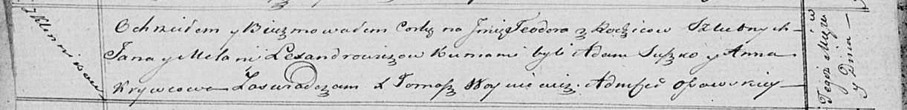

**Александрович Тодора Янова (Lexandrowiczowna Teodora)**

9 мая 1821 г -- крещение (НИАБ 136-13-894, лист 106об, №25/1821-р
(ориг)).

**НИАБ 136-13-894:** Лист 106об. **Метрическая запись №25/1821-р
(ориг).**

Осовская Покровская церковь. 9 мая 1821 года. Метрическая запись о
крещении.

Lexandrowiczowna Teodora -- дочь родителей с деревни Клинники.

Lexandrowicz Jan -- отец.

Lexandrowiczowa Mełanija -- мать.

Suszko Adam -- кум.

Krywcowa Anna -- кума.

Woyniewicz Tomasz -- ксёндз.
