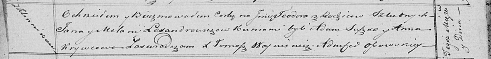

**Александрович Ян (Lexandrowicz Jan)**

14 января 1817 г -- венчание с девкой Меланией Ксензничек (НИАБ
136-13-920, лист 24, №3/1817-б (ориг)).

9 мая 1821 г -- крещение дочери Тодоры (НИАБ 136-13-894, лист 106об,
№25/1821-р (ориг)).

**НИАБ 136-13-920:** Лист 24. **Метрическая запись №3/1817-б (ориг).**

Осовская Покровская церковь. 14 января 1817 года. Запись о венчании.

Lexandrowicz Jan -- жених, молодой, парафии Осовской, с деревни
Клинники.

Kięzniczkowna Mełanija -- невеста, девка.

Babouka Kondrat -- свидетель.

Suszko Chwiedor -- свидетель.

Woyniewicz Tomasz -- ксёндз.

**НИАБ 136-13-894:** Лист 106об. **Метрическая запись №25/1821-р
(ориг).**

Осовская Покровская церковь. 9 мая 1821 года. Метрическая запись о
крещении.

Lexandrowiczowna Teodora -- дочь родителей с деревни Клинники.

Lexandrowicz Jan -- отец.

Lexandrowiczowa Mełanija -- мать.

Suszko Adam -- кум.

Krywcowa Anna -- кума.

Woyniewicz Tomasz -- ксёндз.
