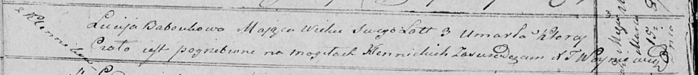

**Бабовка Люция (Baboukowa Lucija)**

15 марта 1821 г -- отпевание, умерла в возрасте 3 лет (родилась около
1818 г) (НИАБ 136-13-919, лист 34об, №2/1821-у (ориг)).

**НИАБ 136-13-919:** Лист 34об. **Метрическая запись №2/1821-у (ориг).**

Осовская униатская церковь. 15 марта 1821 года. Метрическая запись об
отпевании.

Baboukowa Lucija -- умершая, 3 года, с деревни Клинники, похоронена на
кладбище деревни Клинники.

Woyniewicz Tomasz -- ксёндз.
