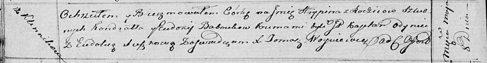
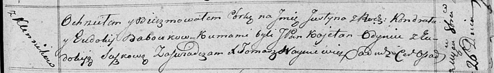

**Бабовка Кондрат (Babouka Kondrat)**

8 мая 1816 г -- крещение дочери Грыпины (НИАБ 136-13-894, лист 93об,
№9/1816-р (ориг)).

26 октября 1818 г -- крещение дочери Юстыны (НИАБ 136-13-894, лист 99,
№33/1818-р (ориг)).

**НИАБ 136-13-894:** Лист 93об. **Метрическая запись №9/1816-р (ориг).**

Осовская Покровская церковь. 8 мая 1816 года. Метрическая запись о
крещении.

Baboukowna Hrypina -- дочь родителей с деревни Клинники.

Babouka Kondrat -- отец.

Baboukowa Eudokija -- мать.

Odyniec Kajetan, JP -- кум, шляхтич.

Suszkowa Eudokia -- кума.

Woyniewicz Tomasz -- ксёндз.

**НИАБ 136-13-894:** Лист 99. **Метрическая запись №33/1818-р (ориг).**

Осовская Покровская церковь. 26 октября 1818 года. Метрическая запись о
крещении.

Baboukowna Justyna -- дочь родителей с деревни Клинники.

Babouka Kondrat -- отец.

Baboukowa Eudokija -- мать.

Odyniec Koetan, JP -- кум, шляхтич.

Suszkowa Eudokija -- кума.

Woyniewicz Tomasz -- ксёндз.
