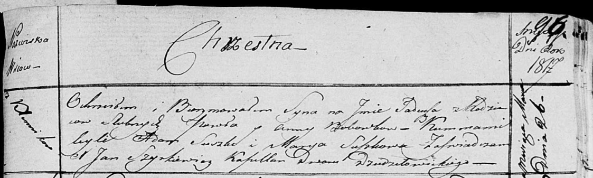

**Бабовка Тадей Павлов (Bobouka Tadeusz)**

26 марта 1817 г -- крещение (НИАБ 136-13-894, лист 96, №20/1817-р
(ориг)).

**НИАБ 136-13-894:** Лист 96. **Метрическая запись №20/1817-р (ориг).**

Осовская Покровская церковь. 26 марта 1817 года. Метрическая запись о
крещении.

Bobowko Tadeusz -- сын родителей с деревни Клинники.

Bobowko Paweł -- отец.

Bobowkowa Anna -- мать.

Suszko Adam -- кум.

Suszkowa Marija -- кума.

Woyniewicz Tomasz -- ксёндз.
