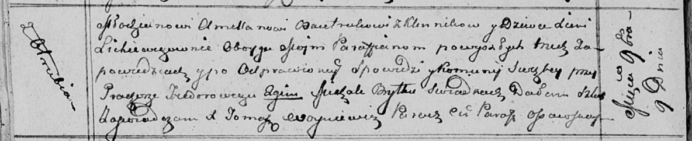
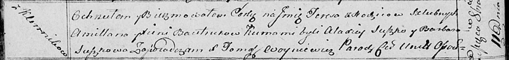
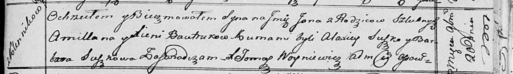
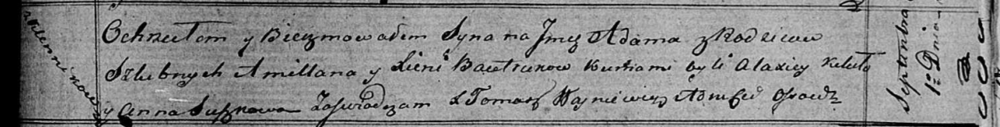
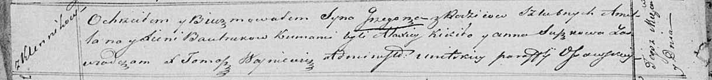

**Бавтрук (в девичестве Лихевич) Ксеня (Bautrukowa Xienia z
Lichiewiczow)**

9 ноября 1813 г -- венчание с молодым Амилляном Бавтруком с деревни
Клинники (НИАБ 136-13-920, лист 20об, №25/1813-б (ориг)).

11 октября 1814 г -- крещение дочери Тересы (НИАБ 136-13-894, лист 90об,
№57/1814-р (ориг)).

20 ноября 1816 г -- крещение сына Яна (НИАБ 136-13-894, лист 95,
№41/1816-р (ориг)).

1 сентября 1819 г -- крещение сына Адама (НИАБ 136-13-894, лист 103,
№52/1819-р (ориг)).

9 мая 1821 г -- крещение сына Грыгора (НИАБ 136-13-894, лист 106об,
№24/1821-р (ориг)).

**НИАБ 136-13-920:** Лист 20об. **Метрическая запись №25/1813-б
(ориг).**

Осовская Покровская церковь. 9 ноября 1813 года. Запись о венчании.

Bautruk Amellan -- жених, молодой, парафии Осовской, с деревни Клинники.

Lichiewiczowna Xienia -- невеста, девка, парафии Осовской, с деревни
Отруб.

Fiedorowicz Prochor -- свидетель.

Brytka Michał -- свидетель.

Woyniewicz Tomasz -- ксёндз.

**НИАБ 136-13-894:** Лист 90об. **Метрическая запись №57/1814-р
(ориг).**

Осовская Покровская церковь. 11 октября 1814 года. Метрическая запись о
крещении.

Bautrukowna Teresa -- дочь родителей с деревни Клинники.

Bautruk Amillan -- отец.

Bautrukowa Xienia -- мать.

Suszko Alaxiey -- кум.

Suszkowa Barbara -- кума.

Woyniewicz Tomasz -- ксёндз.

**НИАБ 136-13-894:** Лист 95. **Метрическая запись №41/1816-р (ориг).**

Осовская униатская церковь. 20 ноября 1816 года. Метрическая запись о
крещении.

Bautruk Jan -- сын родителей с деревни Клинники.

Bautruk Amillan -- отец.

Bautrukowa Xienia -- мать.

Suszko Alaxiey -- кум.

Suszkowa Barbara -- кума.

Woyniewicz Tomasz -- ксёндз.

**НИАБ 136-13-894:** Лист 103. **Метрическая запись №52/1819-р (ориг).**

Осовская Покровская церковь. 1 сентября 1819 года. Метрическая запись о
крещении.

Bautruk Adam -- сын родителей с деревни Клинники.

Bautruk Amillan -- отец.

Bautrukowa Xienia -- мать.

Kikiło Alaxiey -- кум.

Suszkowa Anna -- кума.

Woyniewicz Tomasz -- ксёндз.

**НИАБ 136-13-894:** Лист 106об. **Метрическая запись №24/1821-р
(ориг).**

Осовская Покровская церковь. 9 мая 1821 года. Метрическая запись о
крещении.

Bautruk Grzegorz -- сын родителей с деревни Клинники.

Bautruk Amillan -- отец.

Bautrukowa Xienia -- мать.

Kikiło Alaxiey -- кум.

Suszkowa Anna -- кума.

Woyniewicz Tomasz -- ксёндз.
