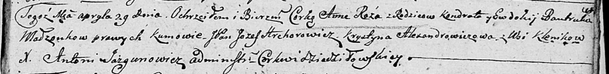

**Бавтрук Анна Кондратова (Bautrukowna Anna Róża)**

29 апреля 1806 г -- крещение (НИАБ 136-13-894, лист 60, №20/1806-р
(ориг)).

**НИАБ 136-13-894:** Лист 60. **Метрическая запись №20/1806-р (ориг).**

{width="6.496527777777778in"
height="0.7952198162729659in"}

Дедиловичская Покровская церковь. 29 апреля 1806 года. Метрическая
запись о крещении.

Bautrukowna Anna Róża -- дочь родителей с деревни Клинники.

Bautruk Kondrat -- отец.

Bautrukowa Ewdokija -- мать.

Hrehorowicz Jozef, JP -- кум, шляхтич.

Alexandrowiczowa Krystyna -- кума.

Jazgunowicz Antoni -- ксёндз.
