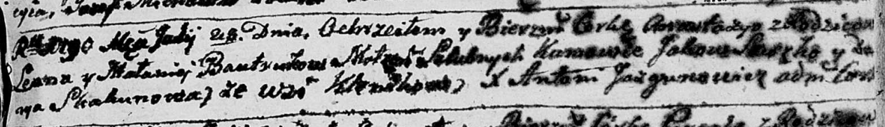

**Бавтрук Анастасия Леонова (Bautrukowna Anastazya)**

28 июля 1790 г -- крещение (НИАБ 136-13-894, лист 10об, №52/1790-р
(ориг)).

**НИАБ 136-13-894:** Лист 10об. **Метрическая запись №52/1790-р
(ориг).**

{width="6.496527777777778in"
height="0.9407195975503062in"}

Дедиловичская Покровская церковь. 28 июля 1790 года. Метрическая запись
о крещении.

Bautrukowna Anastazya -- дочь родителей с деревни Клинники.

Bautruk Leon -- отец.

Bautrukowa Małanieja -- мать.

Suszko Jakow - кум.

Skakunowa Darya - кума.

Jazgunowicz Antoni -- ксёндз.
