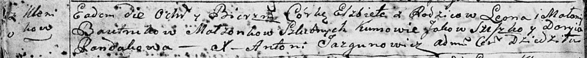

**Бавтрук Елисавета Львова (Bautrukowna Elżbieta)**

14 ноября 1792 г -- крещение (НИАБ 136-13-894, лист 17об, №76/1792-р
(ориг)).

**НИАБ 136-13-894:** Лист 17-об. **Метрическая запись №76/1792-р
(ориг).**

{width="6.496527777777778in"
height="0.6537423447069116in"}

Дедиловичская Покровская церковь. 14 ноября 1792 года. Метрическая
запись о крещении.

Bautrukowna Elżbieta -- дочь родителей с деревни Клинники.

Bautruk Leon -- отец.

Bautrukowa Małanija -- мать.

Sziszko Jakow - кум.

Randakowa Daryia - кума.

Jazgunowicz Antoni -- ксёндз.
