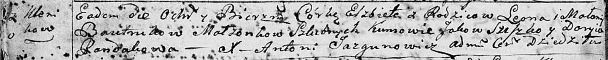
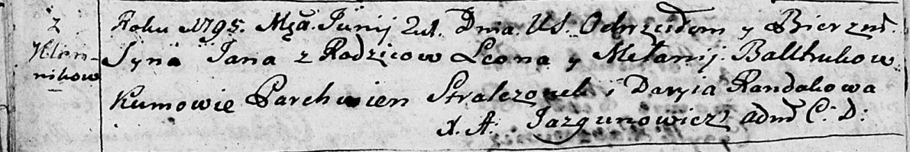

**Бавтрук Леон (Bautruk Leon)**

28 июля 1790 г -- крещение дочери Анастасии (НИАБ 136-13-894, лист 10об,
№52/1790-р (ориг)).

14 ноября 1792 г -- крещение дочери Елисаветы (НИАБ 136-13-894, лист
17об, №76/1792-р (ориг)).

21 июня 1795 г -- крещение сына Яна (НИАБ 136-13-894, лист 24об,
№17/1795-р (ориг)), (РГИА 823-2-18, лист 252об, №14/1795-р (коп)).

Январь 1801 г -- крестный отец Мартина, сына Давида и Грипины Савков с
деревни Клинники (НИАБ 937-4-32, лист 4, №1/1801-р).

**НИАБ 136-13-894:** Лист 10об. **Метрическая запись №52/1790-р
(ориг).**

Дедиловичская Покровская церковь. 28 июля 1790 года. Метрическая запись
о крещении.

Bautrukowna Anastazya -- дочь родителей с деревни Клинники.

Bautruk Leon -- отец.

Bautrukowa Małanieja -- мать.

Suszko Jakow - кум.

Skakunowa Darya - кума.

Jazgunowicz Antoni -- ксёндз.

**НИАБ 136-13-894:** Лист 17-об. **Метрическая запись №76/1792-р
(ориг).**

Дедиловичская Покровская церковь. 14 ноября 1792 года. Метрическая
запись о крещении.

Bautrukowna Elżbieta -- дочь родителей с деревни Клинники.

Bautruk Leon -- отец.

Bautrukowa Małanija -- мать.

Sziszko Jakow - кум.

Randakowa Daryia - кума.

Jazgunowicz Antoni -- ксёндз.

Лист 24-об. **Метрическая запись №17/1795-р (ориг).**

Дедиловичская Покровская церковь. 21 июня 1795 года. Метрическая запись
о крещении.

Bautruk Jan -- сын родителей с деревни Клинники.

Bautruk Leon -- отец.

Bautrukowa Mełanija -- мать.

Stralczonek Parchwien - кум.

Randakowa Daryia - кума.

Jazgunowicz Antoni -- ксёндз.

**РГИА 823-2-18:** Лист 252об. **Метрическая запись №14/1795-р (коп).**

Дедиловичская Покровская церковь. 21 июня 1795 года. Метрическая запись
о крещении.

Bautruk Jan -- сын родителей с деревни Клинники.

Bautruk Leon -- отец.

Bautrukowa Małania -- мать.

Stralczonek Parchwien -- кум.

Randakowa Darya -- кума.

Jazgunowicz Antoni -- ксёндз.

**НИАБ 937-4-32:** Лист 4. **Метрическая запись №1/1801-р.**

Дедиловичский костел Наисвятейшего Сердца Иисуса. 1? января 1801 года.
Метрическая запись о крещении.

Sauko Martin -- сын крестьян с деревни Клинники.

Sauko Dawid -- отец.

Saukowa Hripina -- мать.

Batruk Leon -- крестный отец, с деревни Клинники.

Sapiowa Anna -- крестная мать, с деревни Клинники.

Linhart Hyacinthus -- ксёндз.
