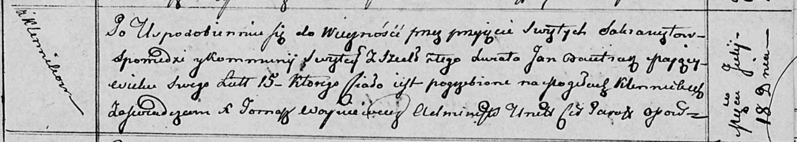

**Бавтрук Ян Леонов (Bautruk Jan)**

21 июня 1795 г -- крещение (НИАБ 136-13-894, лист 24об, №17/1795-р
(ориг)), (РГИА 823-2-18, лист 252об, №14/1795-р (коп)).

18 июля 1812 г -- отпевание, умер в возрасте 15 лет (НИАБ 136-13-919,
лист 24, №12/1812-у (ориг)).

**НИАБ 136-13-894:** Лист 24-об. **Метрическая запись №17/1795-р
(ориг).**

{width="6.496527777777778in"
height="1.0909120734908135in"}

Дедиловичская Покровская церковь. 21 июня 1795 года. Метрическая запись
о крещении.

Bautruk Jan -- сын родителей с деревни Клинники.

Bautruk Leon -- отец.

Bautrukowa Mełanija -- мать.

Stralczonek Parchwien - кум.

Randakowa Daryia - кума.

Jazgunowicz Antoni -- ксёндз.

**РГИА 823-2-18:** Лист 252об. **Метрическая запись №14/1795-р (коп).**

{width="6.496527777777778in"
height="1.21875in"}

Дедиловичская Покровская церковь. 21 июня 1795 года. Метрическая запись
о крещении.

Bautruk Jan -- сын родителей с деревни Клинники.

Bautruk Leon -- отец.

Bautrukowa Małania -- мать.

Stralczonek Parchwien -- кум.

Randakowa Darya -- кума.

Jazgunowicz Antoni -- ксёндз.

**НИАБ 136-13-919:** Лист 24. **Метрическая запись №12/1812-у (ориг).**

{width="6.496527777777778in"
height="1.1652777777777779in"}

Осовская униатская церковь. 18 июля 1812 года. Метрическая запись об
отпевании.

Bautruk Jan -- умерший, 15 лет, с деревни Клинники, похоронен на
кладбище деревни Клинники.

Woyniewicz Tomasz -- ксёндз.
