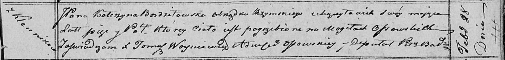

**Бурдзиловская Катерына Миколаева, шляхтянка (Burdziłowska,
Bordziłowska Katerzyna Zofia)**

18 ноября 1814 г -- крещение (НИАБ 136-13-894, лист 91, №66/1814-р
(ориг)).

28 февраля 1820 г -- отпевание, умерла в возрасте 5 лет (НИАБ
136-13-919, лист 33, №2/1820-у (ориг)).

**НИАБ 136-13-894:** Лист 91. **Метрическая запись №66/1814-р (ориг).**

{width="6.496527777777778in"
height="1.3088265529308836in"}

Осовская Покровская церковь. 18 ноября 1814 года. Метрическая запись о
крещении.

Burdzilowka Katerzyna Zofia, JP -- дочь родителей с деревни Клинники,
шляхтянка.

Burdziłowski Mikołay, JP -- отец, шляхтич.

Burdzilowska z Szymonowskich Tekla, JP -- мать, шляхтянка.

Rogalski Jozef, JP -- кум, коморник ... Ошмянский?, шляхтич.

Piskulewiczowa Korolina, JP -- кума, шляхтянка.

Kosinski Waleryan, JP -- ассистент, шляхтич.

Woyniewiczowna Katerzyna, JP -- ассистентка, шляхтянка.

Woyniewicz Tomasz -- ксёндз.

**НИАБ 136-13-919:** Лист 33. **Метрическая запись №2/1820-у (ориг).**

{width="6.496527777777778in"
height="0.7736111111111111in"}

Осовская униатская церковь. 28 февраля 1820 года. Метрическая запись об
отпевании.

Bordziłowska Katerzyna, JP -- умершая, шляхтянка, католичка, 5 лет, с
деревни Клинники, похоронена на кладбище деревни Осово.

Woyniewicz Tomasz -- ксёндз.
