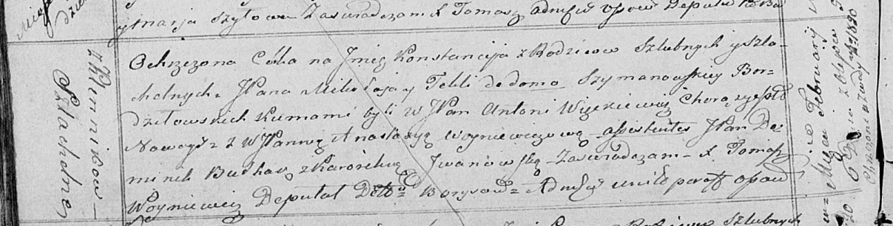

**Бурдзиловская Констация Миколаева, шляхтянка (Bоrdziłowska
Konstancija)**

6 февраля 1821 г -- крещение (НИАБ 136-13-894, лист 105об, №8/1821-р
(ориг)).

**НИАБ 136-13-894:** Лист 105об. **Метрическая запись №8/1821-р
(ориг).**

Осовская Покровская церковь. 6 февраля 1821 года. Метрическая запись о
крещении.

Bordziłowska Konstancija, JP -- дочь родителей с деревни Клинники,
шляхтянка.

Bordziłowski Mikołay, JP -- отец, шляхтич.

Bordziłowska z Szimanowskich Tekla, JP -- мать, шляхтянка.

Węckiewicz Antoni, WJP -- кум, шляхтич, хорунжий Новогрудский.

Woyniewiczowa Anastazija, WJP -- кума, шляхтянка.

Bułhak Dominik, JP -- ассистент, шляхтич.

Jwanowska Karolina? -- ассистентка.

Woyniewicz Tomasz -- ксёндз.
