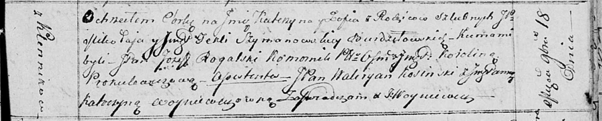
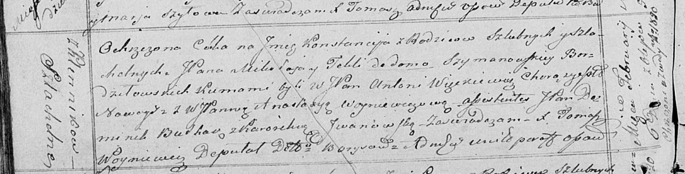

**Бурдзиловская (Шимоновская) Текля, шляхтянка (Burdziłowska,
Bordziłowska Tekla z Szymonowskich, Szymanowskich)**

18 ноября 1814 г -- крещение дочери Катерыны Софии (НИАБ 136-13-894,
лист 91, №66/1814-р (ориг)).

6 февраля 1821 г -- крещение дочери Констанции (НИАБ 136-13-894, лист
105об, №8/1821-р (ориг)).

**НИАБ 136-13-894:** Лист 91. **Метрическая запись №66/1814-р (ориг).**

Осовская Покровская церковь. 18 ноября 1814 года. Метрическая запись о
крещении.

Burdzilowka Katerzyna Zofia, JP -- дочь родителей с деревни Клинники,
шляхтянка.

Burdziłowski Mikołay, JP -- отец, шляхтич.

Burdzilowska z Szymonowskich Tekla, JP -- мать, шляхтянка.

Rogalski Jozef, JP -- кум, коморник ... Ошмянский?, шляхтич.

Piskulewiczowa Korolina, JP -- кума, шляхтянка.

Kosinski Waleryan, JP -- ассистент, шляхтич.

Woyniewiczowna Katerzyna, JP -- ассистентка, шляхтянка.

Woyniewicz Tomasz -- ксёндз.

**НИАБ 136-13-894:** Лист 105об. **Метрическая запись №8/1821-р
(ориг).**

Осовская Покровская церковь. 6 февраля 1821 года. Метрическая запись о
крещении.

Bordziłowska Konstancija, JP -- дочь родителей с деревни Клинники,
шляхтянка.

Bordziłowski Mikołay, JP -- отец, шляхтич.

Bordziłowska z Szimanowskich Tekla, JP -- мать, шляхтянка.

Węckiewicz Antoni, WJP -- кум, шляхтич, хорунжий Новогрудский.

Woyniewiczowa Anastazija, WJP -- кума, шляхтянка.

Bułhak Dominik, JP -- ассистент, шляхтич.

Jwanowska Karolina? -- ассистентка.

Woyniewicz Tomasz -- ксёндз.
