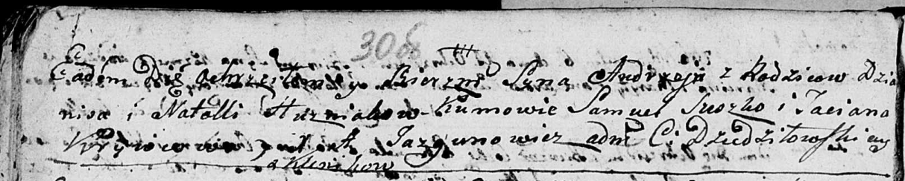
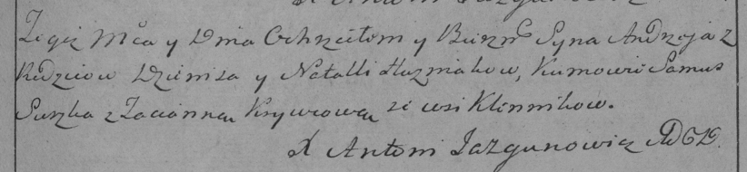

**Гузняк Наталья (Huzniakowa Natalla)**

24 августа 1796 г -- крещение сына Андрея (НИАБ 136-13-894, лист 30об,
№75/1796-р (коп)), (РГИА 823-2-18, лист 257, №45/1796-р (коп)).

10 марта 1807 г -- крещение дочери Евы (НИАБ 136-13-894, лист 62,
№16/1807-р (коп)), (РГИА 823-2-18, лист 257, №45/1796-р (коп)).

**НИАБ 136-13-894:** Лист 30-об. **Метрическая запись №75/1796-р
(ориг).**

Дедиловичская Покровская церковь. 24 августа 1796 года. Метрическая
запись о крещении.

Huzniak Andrzey -- сын родителей с деревни Клинники.

Huzniak Dzianis -- отец.

Huzniakowa Natalla -- мать.

Suszko Samuel - кум.

Krywcowa Taciana - кума.

Jazgunowicz Antoni -- ксёндз.

**РГИА 823-2-18:** Лист 257. **Метрическая запись №45/1796-р (коп).**

Дедиловичская Покровская церковь. 24 августа 1796 года. Метрическая
запись о крещении.

Huzniak Andrzey -- сын родителей с деревни Клинники.

Huzniak Dzienis -- отец.

Huzniakowa Natalla -- мать.

Suszko Samus -- кум.

Krywcowa Tacianna -- кума.

Jazgunowicz Antoni -- ксёндз.

**НИАБ 136-13-894:** Лист 62. **Метрическая запись №16/1807-р (ориг).**

Дедиловичская Покровская церковь. 10 марта 1807 года. Метрическая запись
о крещении.

Huzniakowna Ewa -- дочь родителей с деревни \[Клинники\].

Huzniak Dzianis -- отец.

Huzniakowa Natalla -- мать.

Suszko Anton -- кум, с деревни Горелое.

Krywcowa Awłasa Taciana -- кума, с деревни Горелое.

Jazgunowicz Antoni -- ксёндз.
