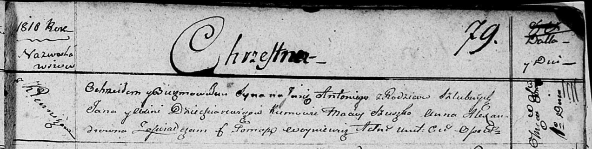

**Дегтяревич Ян (Dziechciarewicz Jan)**

1 октября 1810 г -- крещение сына Антона (НИАБ 136-13-894, лист 79,
№46/1810-р (ориг)).

**НИАБ 136-13-894:** Лист 79. **Метрическая запись №46/1810-р (ориг).**

Осовская Покровская церковь. 1 октября 1810 года. Метрическая запись о
крещении.

Dziechciarewicz Antoni -- сын родителей с деревни Клинники.

Dziechciarewicz Jan -- отец

Dziechciarewiczowa Axinia -- мать.

Szuszko Maciey -- кум.

Alexandrowna Anna -- кума.

Woyniewicz Tomasz -- ксёндз.
