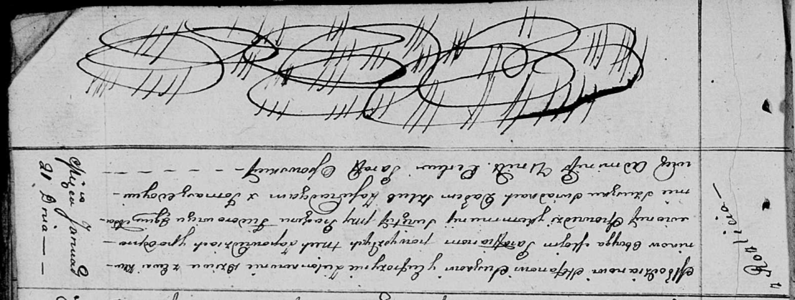

**Сушко (в девичестве Зелёнко) Ефрозына (Suszkowa Eufrozyna z
Zielonkow)**

21 января 1812 г -- венчание с молодым Стефаном Сушко с деревни Разлитье
(НИАБ 136-13-920, лист 18, №2/1812-б (ориг)).

**НИАБ 136-13-920:** Лист 18. **Метрическая запись №2/1812-б (ориг).**

{width="6.496527777777778in"
height="2.4614260717410326in"}

Осовская Покровская церковь. 21 января 1812 года. Метрическая запись о
венчании.

Suszko Stefan -- жених, молодой, парафии Осовской, с деревни Разлитье.

Zielonkowna Eufrozynia -- невеста, девка, парафии Осовской, с деревни
Клинники.

Fiedorowicz Prochor -- свидетель.

Szuszko Adam -- свидетель.

Woyniewicz Tomasz -- ксёндз.
