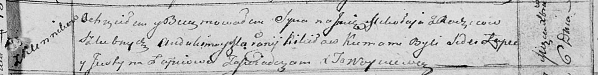

**Кикило Евдокия Авдакимова (Kikiłowna Eudokija)**

1 марта 1821 г -- крещение (НИАБ 136-13-894, лист 105об, №13/1821-р
(ориг)).

**НИАБ 136-13-894:** Лист 106. **Метрическая запись №13/1821-р (ориг).**

{width="6.496527777777778in"
height="0.8079593175853018in"}

Осовская Покровская церковь. 1 марта 1821 года. Метрическая запись о
крещении.

Kikiłowna Eudokija -- дочь родителей с деревни Клинники.

Kikiło Audakim -- отец.

Kikiłowa Mełanija -- мать.

Suszko Symon -- кум.

Suszkowa Agata -- кума.

Woyniewicz Tomasz -- ксёндз.
