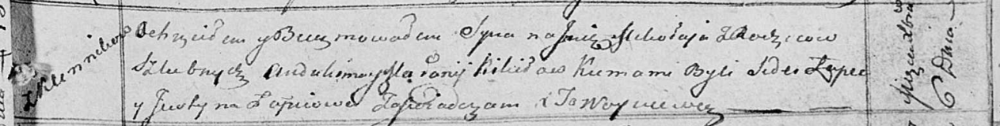
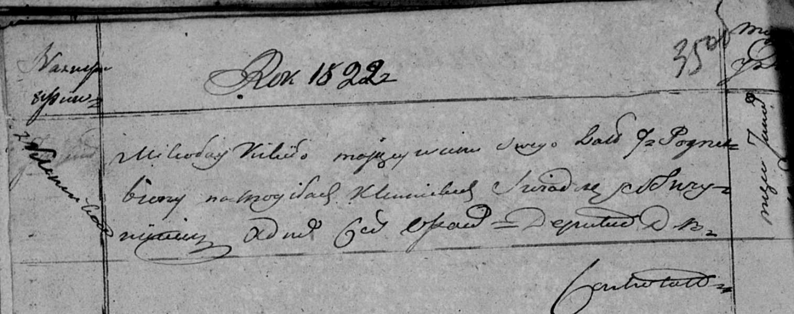

**Кикило Миколай Авдакимов (Kikiło Mikołay)**

6 декабря 1813 г -- крещение (НИАБ 136-13-894, лист 88, №43/1813-р
(ориг)).

13 января 1822 г -- отпевание, умер в возрасте 9 лет (НИАБ 136-13-919,
лист 35об, №1/1822-у (ориг)).

**НИАБ 136-13-894:** Лист 88. **Метрическая запись №43/1813-р (ориг).**

Осовская Покровская церковь. 6 декабря 1813 года. Метрическая запись о
крещении.

Kikiło Mikołay -- сын родителей с деревни Клинники.

Kikiło Audakim -- отец.

Kikiłowa Małanija -- мать.

Łapeć Sider -- кум.

Łapciowa Justyna -- кума.

Woyniewicz Tomasz -- ксёндз.

**НИАБ 136-13-919:** Лист 35об. **Метрическая запись №1/1822-у (ориг).**

Осовская униатская церковь. 13 января 1822 года. Метрическая запись об
отпевании.

Kikiło Mikołay -- умерший, 9 лет, с деревни Клинники, похоронен на
кладбище деревни Клинники.

Woyniewicz Tomasz -- ксёндз.
