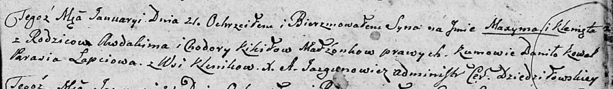

**Кикило Максым Авдакимов (Kikiło Maxym Klemęt)**

21 января 1806 г -- крещение (НИАБ 136-13-894, лист 59, №3/1806-р
(ориг)).

**НИАБ 136-13-894:** Лист 59. **Метрическая запись №3/1806-р (ориг).**

Дедиловичская Покровская церковь. 21 января 1806 года. Метрическая
запись о крещении.

Kikiło Maxym Klemęt -- сын родителей с деревни Клинники.

Kikiło Awdakim -- отец.

Kikiło Chodora -- мать.

Kowal Daniło -- кум.

Łapciowa Parasia -- кума.

Jazgunowicz Antoni -- ксёндз.
