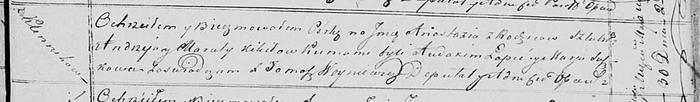

**Кикило Анастасия Андреева (Kikiłowna Anastazija)**

30 мая 1820 г -- крещение (НИАБ 136-13-894, лист 104, №15/1820-р
(ориг)).

**НИАБ 136-13-894:** Лист 104. **Метрическая запись №15/1820-р (ориг).**

Осовская Покровская церковь. 30 мая 1820 года. Метрическая запись о
крещении.

Kikiłowna Anastazija -- дочь родителей с деревни Клинники.

Kikiło Andrzey -- отец.

Kikiłowa Maruta -- мать.

Łapieć Audakim -- кум.

Suszkowna Marja -- кума.

Woyniewicz Tomasz -- ксёндз.
