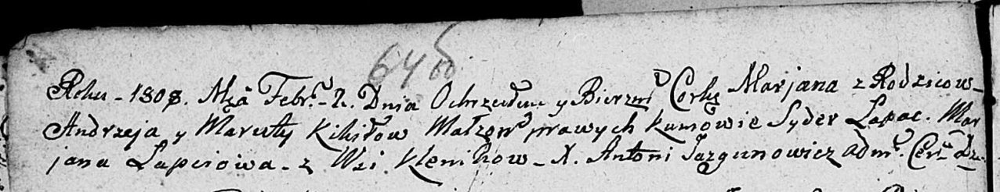

**Кикило Андрей (Kikiło Andrzey)**

29 января 1800 г -- свидетель венчания молодого Мирона Леонова Сушко с
деревни Клинники с девкой Марьяной Семёновой Кикило с деревни Клинники
(НИАБ 136-13-920, лист 6об, №1/1800-б (ориг), НИАБ 136-13-949, лист 107,
№1/1800-б (коп)).

27 ноября 1804 г -- крещение дочери Юстыны Евдокии (НИАБ 136-13-894,
лист 55об, №55/1804-р (ориг)).

7 февраля 1808 г -- крещение дочери Марьяны (НИАБ 136-13-894, лист 64об,
№6/1808-р (ориг)).

16 апреля 1811 г -- крещение дочери Зеновии (НИАБ 136-13-894, лист 80об,
№20/1811-р (ориг)).

1 июля 1816 г -- крещение сына Яна (НИАБ 136-13-894, лист 94, №18/1816-р
(ориг)).

23 июня 1818 г -- крещение дочери Марьи (НИАБ 136-13-894, лист 98об,
№19/1818-р (ориг)).

30 мая 1820 г -- крещение дочери Анастасии (НИАБ 136-13-894, лист 104,
№15/1820-р (ориг)).

11 сентября 1821 г -- крещение дочери Параси (НИАБ 136-13-894, лист 107,
№43/1821-р (ориг)).

**НИАБ 136-13-894:** Лист 6об. **Метрическая запись №1/1800-б (ориг).**

Дедиловичская Покровская церковь. 29 января 1800 года. Метрическая
запись о венчании.

Suszko Miron syn Leona -- жених, молодой, с деревни \[Клинники\].

Kikiłowna Marjana córka Siemiona -- невеста, девка, с деревни
\[Клинники\].

Kikiło Andrzey -- свидетель, деревня Клинники.

Łapac Maxym -- свидетель, деревня Клинники.

Jazgunowicz Antoni -- ксёндз.

**НИАБ 136-13-949:** Лист 107. **Метрическая запись №1/1800-б (коп).**

(См. тж.: НИАБ 136-13-920, лист 6об, №1/1800-б (ориг))

Дедиловичская Покровская церковь. 29 января 1800 года. Метрическая
запись о венчании.

Suszko Miron, syn Leona -- жених, молодой, с деревни Клинники.

Kikiłowna Marjana, córka Siemiona -- невеста, девка с деревни
\[Клинники\].

Kikiło Andrzey -- свидетель с деревни \[Клинники\].

Łapac Maxym -- свидетель с деревни \[Клинники\].

Jazgunowicz Antoni -- ксёндз.

**НИАБ 136-13-894:** Лист 55об. **Метрическая запись №55/1804-р
(ориг).**

Дедиловичская Покровская церковь. 27 ноября 1804 года. Метрическая
запись о крещении.

Kikiłowna Justyna Ewdokia -- дочь родителей с деревни Клинники.

Kikiło Andrzey -- отец.

Kikiłowa Marjana -- мать.

Łapać Sider -- кум, с деревни Клинники.

Łapciowa Marjana -- кума.

Jazgunowicz Antoni -- ксёндз.

**НИАБ 136-13-894:** Лист 64об. **Метрическая запись №6/1808-р (ориг).**

Дедиловичская Покровская церковь. 7 февраля 1808 года. Метрическая
запись о крещении.

Kikiłowna Marjana -- дочь родителей с деревни Клинники.

Kikiło Andrzey -- отец.

Kikiłowa Maruta -- мать.

Łapać Syder -- кум.

Łapciowa Marjana -- кума.

Jazgunowicz Antoni -- ксёндз.

**НИАБ 136-13-894:** Лист 80об. **Метрическая запись №20/1811-р
(ориг).**

Осовская Покровская церковь. 16 апреля 1811 года. Метрическая запись о
крещении.

Kikiłowna Zienowia -- дочь родителей с деревни Клинники.

Kikiło Andrzey -- отец.

Kikiłowa Maruta -- мать.

Łapeć Leon -- кум.

Łapciowa Marjana -- кума.

Woyniewicz Tomasz -- ксёндз.

**НИАБ 136-13-894:** Лист 94. **Метрическая запись №18/1816-р (ориг).**

Осовская Покровская церковь. 1 июля 1816 года. Метрическая запись о
крещении.

Kikiło Jan -- сын родителей с деревни Клинники.

Kikiło Andrzey -- отец.

Kikiłowa Maruta -- мать.

Łapieć Sider -- кум.

Łapciowa Justyna -- кума.

Woyniewicz Tomasz -- ксёндз.

**НИАБ 136-13-894:** Лист 98об. **Метрическая запись №19/1818-р
(ориг).**

Осовская Покровская церковь. 23 июня 1818 года. Метрическая запись о
крещении.

Kikiłowna Marja -- дочь родителей с деревни Клинники.

Kikiło Andrzey -- отец.

Kikiłowa Maruta -- мать.

Łapieć Audakim -- кум.

Kiszkurniurka Juhanna -- кума.

Woyniewicz Tomasz -- ксёндз.

**НИАБ 136-13-894:** Лист 104. **Метрическая запись №15/1820-р (ориг).**

Осовская Покровская церковь. 30 мая 1820 года. Метрическая запись о
крещении.

Kikiłowna Anastazija -- дочь родителей с деревни Клинники.

Kikiło Andrzey -- отец.

Kikiłowa Maruta -- мать.

Łapieć Audakim -- кум.

Suszkowna Marja -- кума.

Woyniewicz Tomasz -- ксёндз.

**НИАБ 136-13-894:** Лист 107. **Метрическая запись №43/1821-р (ориг).**

Осовская Покровская церковь. 11 сентября 1821 года. Метрическая запись о
крещении.

Kikiłowna Parasia -- дочь родителей с деревни \[Клинники\].

Kikiło Andrzey -- отец.

Kikiłowa Maruta -- мать.

Łapieć Audakim -- кум.

Suszkowa Marja -- кума.

Woyniewicz Tomasz -- ксёндз.
