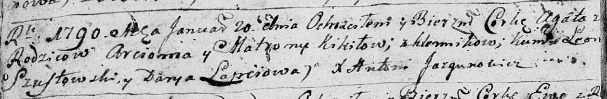

**Кикило Агата Арцёмова (Kikiłowna Agata)**

20 января 1790 г -- крещение (НИАБ 136-13-894, лист 8об, №7/1790-р
(ориг)).

**НИАБ 136-13-894:** Лист 8об. **Метрическая запись №7/1790-р (ориг).**

Дедиловичская Покровская церковь. 20 января 1790 года. Метрическая
запись о крещении.

Kikiłowna Agata -- дочь родителей с деревни Клинники.

Kikiło Arciom -- отец.

Kikiłowa Matrona -- мать.

Szustowski Leon - кум.

Łapćowa Darya - кума.

Jazgunowicz Antoni -- ксёндз.
