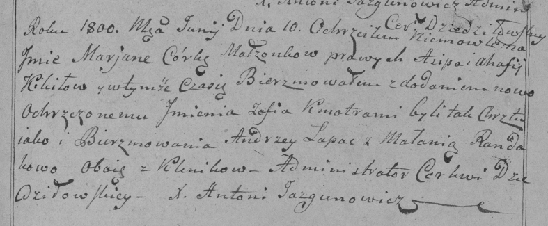
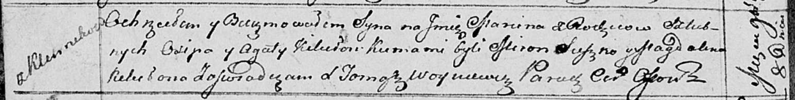

**Кикило Агапа, Агата (Kikiłowa Ahapa, Agata)**

18 октября 1787 г -- крещение дочери Анны (НИАБ 136-13-894, лист 34об,
№62/1797-р (ориг)), (РГИА 823-2-18, лист 261, №43/1797-р (коп)).

10 июня 1800 г -- крещение дочери Марьяны Софии (РГИА 823-2-18, лист
276, №13/1800-р (коп), НИАБ 136-13-949, лист 102, №15/1800-р (коп)).

8 июля 1806 г -- крещение сына Павла (НИАБ 136-13-894, лист 60об,
№29/1806-р (ориг)).

30 ноября 1808 г -- вероятно, крестная мать Адама, сына Александровичей
Курылы и Крыстыны с деревни Клинники (НИАБ 136-13-894, лист 73,
№46/1808-р (ориг)).

16 июня 1810 г -- крещение дочери Магдалены Марьяны (НИАБ 136-13-894,
лист 77об, №22/1810-р (ориг)).

8 ноября 1813 г -- крещение сына Марцина (НИАБ 136-13-894, лист 87об,
№37/1813-р (ориг)).

**НИАБ 136-13-894:** Лист 34об. **Метрическая запись №62/1797-р
(ориг).**

Дедиловичская Покровская церковь. 18 октября 1797 года. Метрическая
запись о крещении.

Kikiłowna Anna -- дочь родителей с деревни Клинники.

Kikiło Asip -- отец.

Kikiłowa Ahapa -- мать.

Łapać Andrzey - кум.

Randakowa Małanija - кума.

Jazgunowicz Antoni -- ксёндз.

**РГИА 823-2-18:** Лист 261. **Метрическая запись №43/1797-р (коп).**

Дедиловичская Покровская церковь. 18 октября 1797 года. Метрическая
запись о крещении.

Kikiłowna Anna -- дочь родителей с деревни Клинники.

Kikiło Asip -- отец.

Kikiłowa Ahapa -- мать.

Łapac Andrzey -- кум.

Rondakowa Małania -- кума.

Jazgunowicz Antoni -- ксёндз.

**РГИА 823-2-18:** Лист 276. **Метрическая запись №13/1800-р (коп).**

Дедиловичская Покровская церковь. 10 июня 1800 года. Метрическая запись
о крещении.

Kikiłowna Marjana Zofia -- дочь родителей с деревни \[Клинники\].

Kikiło Asip -- отец.

Kikiło Ahafija -- мать.

Łapac Andrzey -- кум, с деревни Клинники.

Randakowa Małania -- кума, с деревни Клинники.

Jazgunowicz Antoni -- ксёндз.

**НИАБ 136-13-949:** Лист 102. **Метрическая запись №15/1800-р (коп).**

(См. тж.: РГИА 823-2-18, лист 276, №13/1800-р (коп))

Дедиловичская Покровская церковь. 10 июня 1800 года. Метрическая запись
о крещении.

Kikiłowna Marjana Róża -- дочь родителей с деревни Клинники.

Kikiło Asip -- отец.

Kikiłowa Ahafia -- мать.

Łapac Andrzey -- кум, с деревни Клинники.

Randakowa Małania - кума, с деревни Клинники.

Jazgunowicz Antoni -- ксёндз.

**НИАБ 136-13-894:** Лист 60об. **Метрическая запись №29/1806-р
(ориг).**

Дедиловичская Покровская церковь. 8 июля 1806 года. Метрическая запись о
крещении.

Kikiło Paweł -- сын родителей с деревни Клинники.

Kikiło Asip -- отец.

Kikiłowa Ahapa -- мать.

Szyłak Andrzey -- кум.

Randakowa Małania -- кума.

Jazgunowicz Antoni -- ксёндз.

**НИАБ 136-13-894:** Лист 73. **Метрическая запись №46/1808-р (ориг).**

Дедиловичская Покровская церковь. 30 ноября 1808 года. Метрическая
запись о крещении.

Alexandrowicz Adam -- сын родителей с деревни Клинники.

Alexandrowicz Kuryła -- отец.

Alexandrowiczowa Krystyna -- мать.

Chwiedorowicz Pachom -- кум, с деревни Клинники.

Kikiłowa Ahapa -- кума, с деревни Клинники.

Jazgunowicz Antoni -- ксёндз.

**НИАБ 136-13-894:** Лист 77об. **Метрическая запись №22/1810-р
(ориг).**

Дедиловичская Покровская церковь. 16 июня 1810 года. Метрическая запись
о крещении.

Kikiłowna Magdalena Marjana -- дочь родителей из деревни Клинники.

Kikiło Asip -- отец.

Kikiłowa Ahapa -- мать.

Suszko Miron -- кум.

Kikiłowa Ahapa -- кума.

Jazgunowicz Antoni -- ксёндз.

**НИАБ 136-13-894:** Лист 87об. **Метрическая запись №37/1813-р
(ориг).**

Осовская Покровская церковь. 8 ноября 1813 года. Метрическая запись о
крещении.

Kikiło Marcin -- сын родителей с деревни Клинники.

Kikiło Osip -- отец.

Kikiłowa Agata -- мать.

Suszko Miron -- кум.

Kikiłowa Magdalena -- кума.

Woyniewicz Tomasz -- ксёндз.
