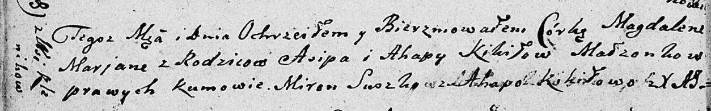

**Кикило Магдалена Асипова (Kikiłowna Magdalena Ahapa)**

16 июня 1810 г -- крещение (НИАБ 136-13-894, лист 77об, №22/1810-р
(ориг)).

**НИАБ 136-13-894:** Лист 77об. **Метрическая запись №22/1810-р
(ориг).**

Дедиловичская Покровская церковь. 16 июня 1810 года. Метрическая запись
о крещении.

Kikiłowna Magdalena Marjana -- дочь родителей из деревни Клинники.

Kikiło Asip -- отец.

Kikiłowa Ahapa -- мать.

Suszko Miron -- кум.

Kikiłowa Ahapa -- кума.

Jazgunowicz Antoni -- ксёндз.
