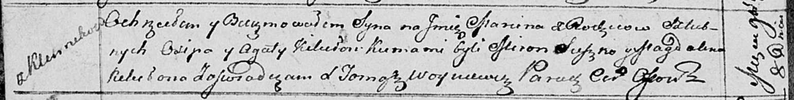

**Кикило Марцин Асипов (Kikiło Marcin)**

8 ноября 1813 г -- крещение (НИАБ 136-13-894, лист 87об, №37/1813-р
(ориг)).

**НИАБ 136-13-894:** Лист 87об. **Метрическая запись №37/1813-р
(ориг).**

Осовская Покровская церковь. 8 ноября 1813 года. Метрическая запись о
крещении.

Kikiło Marcin -- сын родителей с деревни Клинники.

Kikiło Osip -- отец.

Kikiłowa Agata -- мать.

Suszko Miron -- кум.

Kikiłowa Magdalena -- кума.

Woyniewicz Tomasz -- ксёндз.
