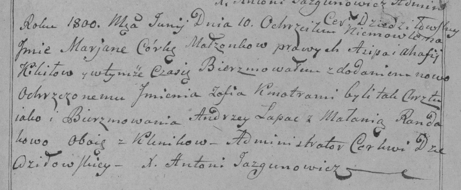
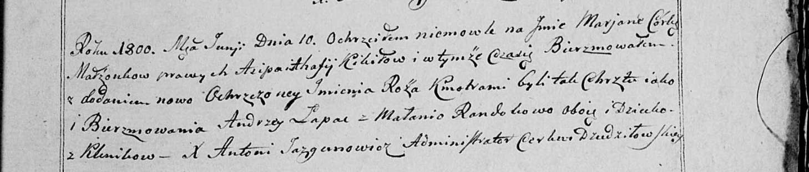

**Кикило Марьяна Асипова (Kikiłowna Marjana Zofija)**

10 июня 1800 г -- крещение дочери Марьяны Софии (РГИА 823-2-18, лист
276, №13/1800-р (коп), НИАБ 136-13-949, лист 102, №15/1800-р (коп)).

**РГИА 823-2-18:** Лист 276. **Метрическая запись №13/1800-р (коп).**

Дедиловичская Покровская церковь. 10 июня 1800 года. Метрическая запись
о крещении.

Kikiłowna Marjana Zofia -- дочь родителей с деревни \[Клинники\].

Kikiło Asip -- отец.

Kikiło Ahafija -- мать.

Łapac Andrzey -- кум, с деревни Клинники.

Randakowa Małania -- кума, с деревни Клинники.

Jazgunowicz Antoni -- ксёндз.

**НИАБ 136-13-949:** Лист 102. **Метрическая запись №15/1800-р (коп).**

(См. тж.: РГИА 823-2-18, лист 276, №13/1800-р (коп))

Дедиловичская Покровская церковь. 10 июня 1800 года. Метрическая запись
о крещении.

Kikiłowna Marjana Róża -- дочь родителей с деревни Клинники.

Kikiło Asip -- отец.

Kikiłowa Ahafia -- мать.

Łapac Andrzey -- кум, с деревни Клинники.

Randakowa Małania - кума, с деревни Клинники.

Jazgunowicz Antoni -- ксёндз.
