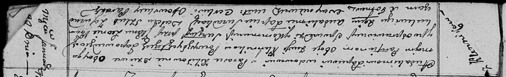

**Лапец (в девичестве Кикило) Парася, Параска (Łapciowa Parasia, Paraska
z Kikiłow)**

22 января 1811 г -- венчание с вдовцом Авдакимом Лапецом с деревни
Клинники (НИАБ 136-13-920, лист 17, №2/1811-б (коп)).

**НИАБ 136-13-920:** Лист 17. **Метрическая запись №2/1811-б (ориг).**

Осовская Покровская церковь. 22 января 1811 года. Метрическая запись о
венчании.

Łapac Audakim -- жених, вдовец, с деревни Клинники.

Kikiłowna Paraska -- невеста, девка, с деревни Клинники.

Prokulewicz Leon, JP -- свидетель, шляхтич.

Łapac Audakim -- свидетель.

Woyniewicz Tomasz -- ксёндз.
