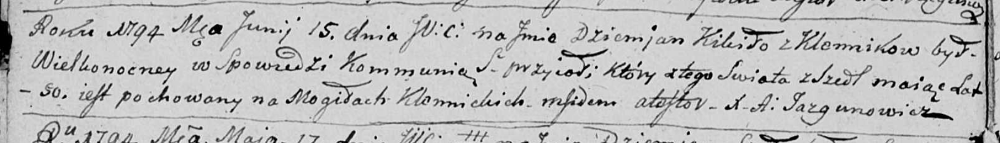

**Кикило Демьян (Kikiło Dziemjan)**

15 июня 1794 г -- отпевание, умер в возрасте 50 лет (родился около 1744
г) (НИАБ 136-13-919, лист 2об, №27/1794-у (ориг)).

**НИАБ 136-13-919:** Лист 2об. **Метрическая запись №27/1794-у (ориг).**

Дедиловичская Покровская церковь. 15 июня 1794 года. Метрическая запись
об отпевании.

Kikiło Dziemjan -- умерший, 50 лет, с деревни Клинники, похоронен на
кладбище деревни Клинники.

Jazgunowicz Antoni -- ксёндз.
