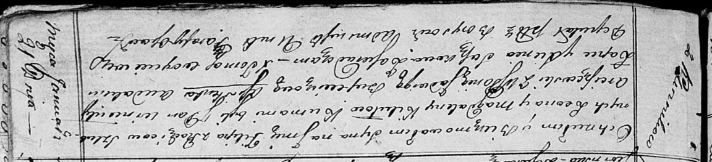

**Кикило Домицеля Леонова (Kikiłowna Domicela)**

8 мая 1814 г -- крещение (НИАБ 136-13-894, лист 89об, №27/1814-р
(ориг)).

**НИАБ 136-13-894:** Лист 89об. **Метрическая запись №27/1814-р
(ориг).**

{width="6.496527777777778in"
height="0.988996062992126in"}

Осовская Покровская церковь. 8 мая 1814 года. Метрическая запись о
крещении.

Kikiłowna Domiceła -- дочь родителей с деревни Клинники.

Kikiło Leon -- отец.

Kikiłowa Magdalena -- мать.

Arciszewski Wincenty, JP -- кум, шляхтич.

Bujewiczowa Jadwiga, JP -- кума, шляхтянка.

Randak Audakim -- ассистент.

Suszkowa Axinia -- ассистентка.

Woyniewicz Tomasz -- ксёндз.
