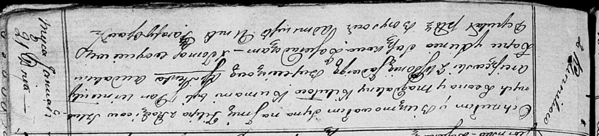

**Кикило Филип Леонов (Kikiło Filip)**

21 января 1817 г -- крещение (НИАБ 136-13-894, лист 95, №6/1817-р
(ориг)).

**НИАБ 136-13-894:** Лист 95. **Метрическая запись №6/1817-р (ориг).**

{width="6.496527777777778in"
height="1.4831583552055994in"}

Осовская Покровская церковь. 21 января 1817 года. Метрическая запись о
крещении.

Kikiło Filip -- сын родителей с деревни Клинники.

Kikiło Leon -- отец.

Kikiłowa Magdalena -- мать.

Arciszewski Wincenty, JP -- кум, шляхтич.

Bujewiczowa Jadwiga, WJP -- кума, шляхтянка.

Łapieć Audakim -- ассистент.

Suszkowa Xienia -- ассистентка.

Woyniewicz Tomasz -- ксёндз.
