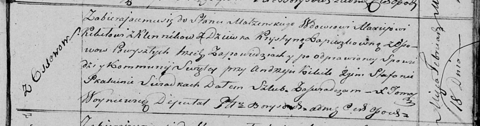
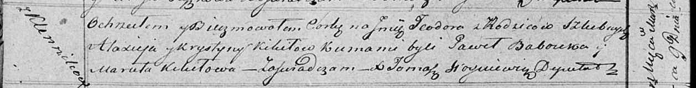

**Кикило Максей (Kikiło Maxiey)**

18 февраля 1818 г -- венчание с девкой Крыстыной Ляпёшкой с деревни
Осово (НИАБ 136-13-920, лист 25, №4/1818-б (ориг)).

9 марта 1819 г -- крещение дочери Тодоры (НИАБ 136-13-894, лист 100об,
№11/1819-р (ориг)).

**НИАБ 136-13-920:** Лист 25. **Метрическая запись №4/1818-б (ориг).**

Осовская Покровская церковь. 18 февраля 1818 года. Запись о венчании.

Kikiło Maxiej -- жених, вдовец, с деревни Клинники.

Lapioszkowna Krystyna -- невеста, девка, с деревни Осово.

Kikiło Andrzey -- свидетель.

Skakun Stefan -- свидетель.

Woyniewicz Tomasz -- ксёндз.

**НИАБ 136-13-894:** Лист 100об. **Метрическая запись №11/1819-р
(ориг).**

Осовская Покровская церковь. 9 марта 1819 года. Метрическая запись о
крещении.

Kikiłowna Teodora -- дочь родителей с деревни Клинники.

Kikiło Maxiey -- отец.

Kikiłowa Krystyna -- мать.

Babouka Paweł -- кум.

Kikiłowa Maruta -- кума.

Woyniewicz Tomasz -- ксёндз.
