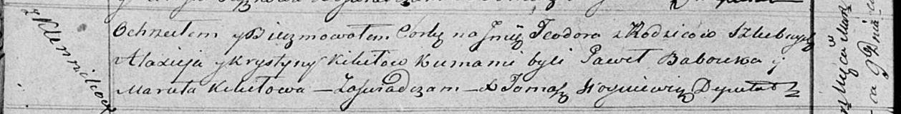

**Кикило Тодора Максеева (Kikiłowna Teodora)**

9 марта 1819 г -- крещение (НИАБ 136-13-894, лист 100об, №11/1819-р
(ориг)).

**НИАБ 136-13-894:** Лист 100об. **Метрическая запись №11/1819-р
(ориг).**

{width="6.496527777777778in"
height="0.8314271653543307in"}

Осовская Покровская церковь. 9 марта 1819 года. Метрическая запись о
крещении.

Kikiłowna Teodora -- дочь родителей с деревни Клинники.

Kikiło Maxiey -- отец.

Kikiłowa Krystyna -- мать.

Babouka Paweł -- кум.

Kikiłowa Maruta -- кума.

Woyniewicz Tomasz -- ксёндз.
