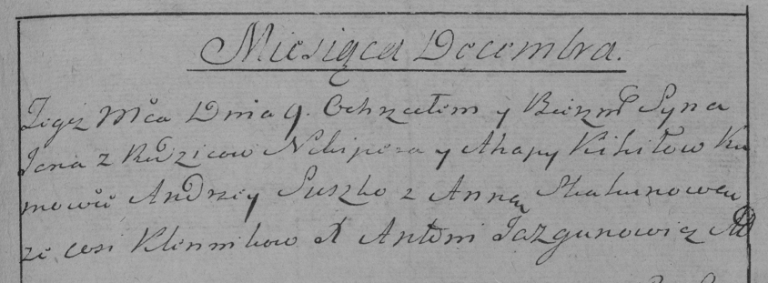

**Кикило Агапа (Kikiłowa Ahapa)**

9 декабря 1784 г -- крещение сына Яна (РГИА 823-2-18, лист 228,
№26/1784-р (коп)).

30 ноября 1808 г -- вероятно, крестная мать Адама, сына Александровичей
Курылы и Крыстыны с деревни Клинники (НИАБ 136-13-894, лист 73,
№46/1808-р (ориг)).

**РГИА 823-2-18:** Лист 228. **Метрическая запись №26/1784-р (коп).**

Дедиловичская Покровская церковь. 9 декабря 1784 года. Метрическая
запись о крещении.

Kikiło Jan -- сын родителей с деревни Клинники.

Kikiło Nikiper -- отец.

Kikiłowa Ahapa -- мать.

Suszko Andrzey -- кум.

Skakunowa Anna - кума.

Jazgunowicz Antoni -- ксёндз.

**НИАБ 136-13-894:** Лист 73. **Метрическая запись №46/1808-р (ориг).**

Дедиловичская Покровская церковь. 30 ноября 1808 года. Метрическая
запись о крещении.

Alexandrowicz Adam -- сын родителей с деревни Клинники.

Alexandrowicz Kuryła -- отец.

Alexandrowiczowa Krystyna -- мать.

Chwiedorowicz Pachom -- кум, с деревни Клинники.

Kikiłowa Ahapa -- кума, с деревни Клинники.

Jazgunowicz Antoni -- ксёндз.
