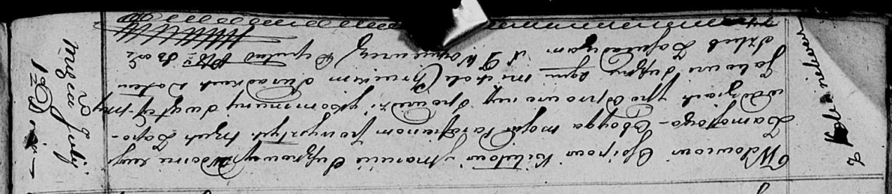

**Кикило (в первом браке Сушко) Марцела (Kikiłowa (Suszkowa) Marcełła)**

1 июля 1816 г -- венчание с вдовцом Осипом Кикило с деревни Клинники
(НИАБ 136-13-920, лист 22об, №3/1816-б (ориг)).

**НИАБ 136-13-920:** Лист 22об. **Метрическая запись №3/1816-б (ориг).**

{width="6.496527777777778in"
height="1.4221423884514435in"}

Осовская Покровская церковь. 1 июля 1816 года. Запись о венчании.

Kikiło Osip -- жених, вдовец, парафии Осовской, с деревни Клинники.

Suszkowa Marcełła -- невеста, вдова, парафии Осовской, с деревни
Замосточье.

Suszko Jakow -- свидетель.

Chrucki Michał -- свидетель.

Woyniewicz Tomasz -- ксёндз.
