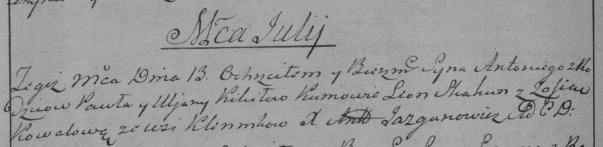

**Кикило Антон Павлов (Kikiło Antonij)**

11 июля 1788 г -- крещение (НИАБ 136-13-894, лист 5, №39/1788-р (ориг)),
(РГИА 823-2-18, лист 236об, №20/1788-р (коп)).

**НИАБ 136-13-894:** Лист 5. **Метрическая запись №39/1788-р (ориг).**

{width="6.496527777777778in"
height="1.1988637357830272in"}

Дедиловичская Покровская церковь. 11 июля 1788 года. Метрическая запись
о крещении.

Kikiło Antonij -- сын родителей с деревни Клинники.

Kikiło Paweł -- отец.

Kikiłowa Ullana -- мать.

Skakun Leon - кум.

Kawalowa Zosia - кума.

Jazgunowicz Antoni -- ксёндз.

**РГИА 823-2-18:** Лист 236об. **Метрическая запись №20/1788-р (коп).**

{width="6.496527777777778in"
height="1.5930555555555554in"}

Дедиловичская Покровская церковь. 13 июля 1788 года. Метрическая запись
о крещении.

Kikiło Antoni -- сын родителей с деревни Клинники.

Kikiło Paweł -- отец.

Kikiłowa Uljana -- мать.

Skakun Leon -- кум.

Kowalowa Zofia - кума.

Jazgunowicz Antoni -- ксёндз.
