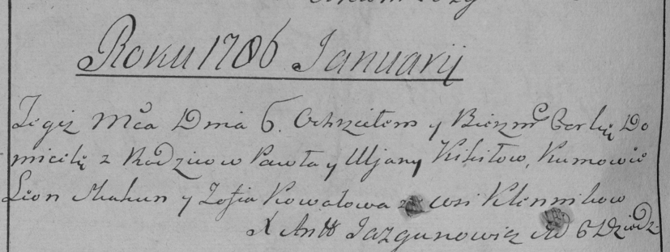
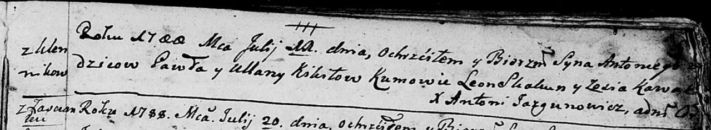
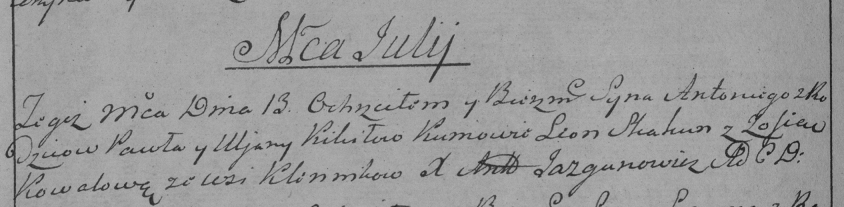
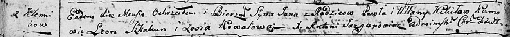
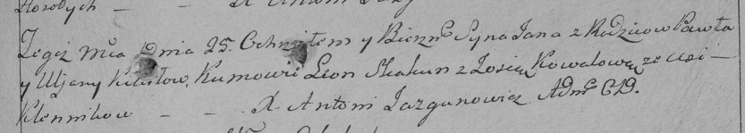
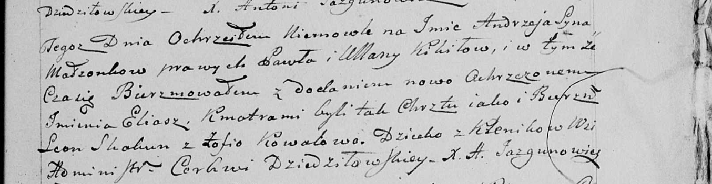

**Кикило Павел (Kikiło Paweł)**

6 января 1786 г -- крещение дочери Домицели (РГИА 823-2-18, лист 230об,
№1/1786-р (коп)).

11 июля 1788 г -- крещение сына Антона (НИАБ 136-13-894, лист 5,
№39/1788-р (ориг)), (РГИА 823-2-18, лист 236об, №20/1788-р (коп)).

12 сентября 1793 г -- крещение сына Яна (НИАБ 136-13-894, лист 20об,
№67/1791-р (ориг)), (РГИА 823-2-18, лист 248, №36/1793-р (коп)).

30 мая 1797 г -- крещение сына Степана (НИАБ 136-13-894, лист 33,
№35/1797-р (ориг)).

6 ноября 1799 г -- крещение сына Андрея Ильи (НИАБ 136-13-938, лист 245,
№44/1799-р (коп)).

**РГИА 823-2-18:** Лист 230об. **Метрическая запись №1/1786-р (коп).**

Дедиловичская Покровская церковь. 6 января 1786 года. Метрическая запись
о крещении.

Kikiłowna Domicela -- дочь родителей с деревни Клинники.

Kikiło Paweł -- отец.

Kikiłowa Uljana -- мать.

Skakun Leon -- кум.

Kowalowa Zofia - кума.

Jazgunowicz Antoni -- ксёндз.

**НИАБ 136-13-894:** Лист 5. **Метрическая запись №39/1788-р (ориг).**

Дедиловичская Покровская церковь. 11 июля 1788 года. Метрическая запись
о крещении.

Kikiło Antonij -- сын родителей с деревни Клинники.

Kikiło Paweł -- отец.

Kikiłowa Ullana -- мать.

Skakun Leon - кум.

Kawalowa Zosia - кума.

Jazgunowicz Antoni -- ксёндз.

**РГИА 823-2-18:** Лист 236об. **Метрическая запись №20/1788-р (коп).**

Дедиловичская Покровская церковь. 13 июля 1788 года. Метрическая запись
о крещении.

Kikiło Antoni -- сын родителей с деревни Клинники.

Kikiło Paweł -- отец.

Kikiłowa Uljana -- мать.

Skakun Leon -- кум.

Kowalowa Zofia - кума.

Jazgunowicz Antoni -- ксёндз.

**НИАБ 136-13-894:** Лист 20-об. **Метрическая запись №67/1793-р
(ориг).**

Дедиловичская Покровская церковь. 12 сентября 1793 года. Метрическая
запись о крещении.

Kikiło Jan -- сын родителей с деревни Клинники.

Kikiło Paweł -- отец.

Kikiłowa Ullana-- мать.

Skakun Leon - кум.

Kowalowa Zosia - кума.

Jazgunowicz Antoni -- ксёндз.

**РГИА 823-2-18:** Лист 248. **Метрическая запись №36/1793-р (коп).**

Дедиловичская Покровская церковь. \[12\] сентября 1793 года. Метрическая
запись о крещении.

Kikiło Jan -- сын родителей с деревни Клинники.

Kikiło Paweł -- отец.

Kikiłowa Uljana -- мать.

Skakun Leon -- кум.

Kowalowa Zosia -- кума.

Jazgunowicz Antoni -- ксёндз.

**НИАБ 136-13-894:** Лист 33. **Метрическая запись №35/1797-р (ориг).**

Дедиловичская Покровская церковь. 30 мая 1797 года. Метрическая запись о
крещении.

Kikiło Stefan -- сын родителей с деревни Клинники.

Kikiło Paweł -- отец.

Kikiłowa Ullana -- мать.

Skakun Leon - кум.

Kowalowa Zosia - кума.

Jazgunowicz Antoni -- ксёндз.

**НИАБ 136-13-938:** Лист 245. **Метрическая запись №44/1799-р (коп).**

(См. тж. НИАБ 136-13-894, лист 40, №49/1799-р (ориг); РГИА 823-2-18,
лист 273, №48/1799-р (коп))

Дедиловичская Покровская церковь. 6 ноября 1799 года. Метрическая запись
о крещении.

Kikiło Andrzey Eliasz -- сын родителей с деревни Клинники \[Осово\].

Kikiło Paweł -- отец.

Kikiłowa Ullana -- мать.

Skakun Leon -- кум, с деревни \[Осовo\].

Kowalowa Zofia - кума, с деревни \[Осовo\].

Jazgunowicz Antoni -- ксёндз.
