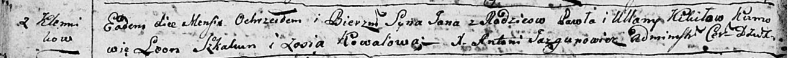

**Кикило Степан Павлов (Kikiło Stefan)**

30 мая 1797 г -- крещение (НИАБ 136-13-894, лист 33, №35/1797-р (ориг)).

**НИАБ 136-13-894:** Лист 33. **Метрическая запись №35/1797-р (ориг).**

{width="6.496527777777778in"
height="1.3745363079615047in"}

Дедиловичская Покровская церковь. 30 мая 1797 года. Метрическая запись о
крещении.

Kikiło Stefan -- сын родителей с деревни Клинники.

Kikiło Paweł -- отец.

Kikiłowa Ullana -- мать.

Skakun Leon - кум.

Kowalowa Zosia - кума.

Jazgunowicz Antoni -- ксёндз.
