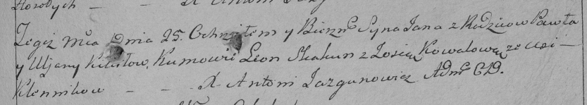

**Кикило Ян Павлов (Kikiło Jan)**

12 сентября 1793 г -- крещение (НИАБ 136-13-894, лист 20об, №67/1791-р
(ориг)), (РГИА 823-2-18, лист 248, №36/1793-р (коп)).

Лист 20-об. **Метрическая запись №67/1793-р (ориг).**

Дедиловичская Покровская церковь. 12 сентября 1793 года. Метрическая
запись о крещении.

Kikiło Jan -- сын родителей с деревни Клинники.

Kikiło Paweł -- отец.

Kikiłowa Ullana-- мать.

Skakun Leon - кум.

Kowalowa Zosia - кума.

Jazgunowicz Antoni -- ксёндз.

**РГИА 823-2-18:** Лист 248. **Метрическая запись №36/1793-р (коп).**

Дедиловичская Покровская церковь. \[12\] сентября 1793 года. Метрическая
запись о крещении.

Kikiło Jan -- сын родителей с деревни Клинники.

Kikiło Paweł -- отец.

Kikiłowa Uljana -- мать.

Skakun Leon -- кум.

Kowalowa Zosia -- кума.

Jazgunowicz Antoni -- ксёндз.
